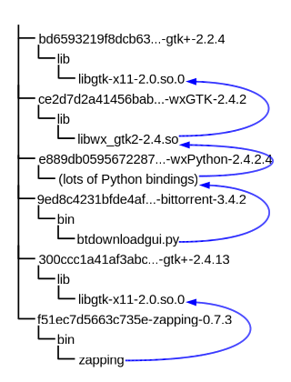

# Software deployment

::: { .incremental }
- Source deployment
  $$
  \begin{CD}
  \text{get source} @>>> \text{build} @>>> \text{install} \\
  \end{CD}
  $$
- Binary deployment
  $$
  \begin{CD}
  \text{get binary} @>>> \text{install} \\
  \end{CD}
  $$
:::

## Problems

- Software should be reproducible when copied among machines.
- Challenges: 
  * Most software today is not self-contained.
  * As they scale, deployment process becomes increasingly complex.
- We deal with these everyday at Deployment Team 🤪. 

---

### Environment issues

::: { .incremental }
- Software today is almost **never self-contained**.
- Dependencies, both build time and run time, needs to be **compatible**. 
- Components need to be able to **find** dependencies. 
- Components may depend on **non-software artifacts** (e.g. databases).
:::

::: { .notes }

- Dependencies: both build time and run time. Especially in OSS world, hard to know which source is the component built from.
- Compatibility: Even for non ABI breaking changes, implementation may change and cause side-effects.
- Needs to be able to find them (e.g. dynmaic linker search path).
- Non-software artifacts, e.g. database, user configurations.

:::

---

### Manageability issues

::: { .incremental }

- **Uninstall / Upgrade**: should not induce failures to another part of the system (e.g. *[DLL hell](https://en.wikipedia.org/wiki/DLL_Hell)*).
- **Administrator queries**: file ownership? disk space consumption? source?
- **Rollbacks**: able to undo effects of upgrades.
- **Variability**: build / deployment configurations may differ.
- **Maintenance**: may have different policies for keeping software up-to-date.
- ... and they scale for a **huge** fleet of machines with **different SKUs**.

:::

::: { .notes }

- **Uninstall**: also should be as clean as possible.
- **Upgrades**: DLL hell as a typical example, where upgrading or installing one application can cause a failure to another application due to shared dynamic libraries.
- **Administrator queries**
- **Rollbacks**: both reproduce the old package and the old configuration.
- **Variability**: software may have different compile options, and may only deploy a subset of components. Especially for OSS, packages with the same name and the same version may be compiled from different source.
- **Maintenance**
- **Heterogeneous network**: different set of components may be deployed to different machines according to hardware differences. Even for the same software, compiler options may differ (e.g. enable AVX512?)

Blood pressure rising? That's what we are dealing with on a daily basis :P

:::

# Industry solutions?

## Idea #1. Let's go monolithic!

Bundle everything to increase reproducibility at runtime.
 
::: { .incremental }
- **Dependencies**? Self-contained packaging!
- **Isolation**? Sandbox technologies!
- **Environment issues**? Containers!
- **Different hardware**? Virtualization!
:::

---

*Wait, this doesn't really simplify build + deployment process.*

::: { .incremental }
- Split build & deployment into *stages* (workflows).
- Manage dependencies between *stages*.
- e.g. GitHub actions, Ansible, etc.
:::

::: { .fragment }
*An ad hoc solution*.
:::

::: { .fragment}
*And we sacrifice sharing between components.*
:::

::: { .incremental }
- Split into layers and share common bases.
- Fetch files on-demand? (e.g. Zero Install System).
- But still, these are done in a coarse-grained manner.
:::

::: { .notes }

Monolithic only solves running the software in a reproducible manner.

Building and deploying monolithic software could still be complex: At least you need to build the container, and think of Dockerfile.

Splitting monolithic architecture can never be fine-grained, because its motavation is to prevent management complexity. 
The more you split, the more you lose benefits of monolithic architecture.

:::

## Idea #2. Global package manager

::: { .incremental }
- Each component provide a set of constraints:
  - Hard clauses, e.g. a dependency must exist.
  - Soft clauses, e.g. version as new as possible.
  - Satisfy all hard clauses. Maximize satisfied soft clauses.
:::

::: { .fragment .fade-in style="color:red" }
MAXSAT problem (NP-complete).
:::

::: { .fragment .fade-in }
Implement pseudo-solvers, e.g. rpm, apt, etc.
:::

::: { .notes }

* Package management is especially critical to UNIX systems because they traditionally insist placing packages in global namespaces.

:::

---

*But it mutates global system state...*

::: { .fragment .fade-in-then-semi-out }

- Depend on different versions of the same package?
- Provide files om the same path?
- Interfere with others in the case of incomplete dependencies and inexact notions of component compatibility.

:::

::: { .fragment }

And upgrading is **destructive**:

- Upgrades are not atomic.
- Files are overwritten, making rollback non-trivial.

:::

::: { .notes }

There are some possible solutions, but usually painful to use in practice: [Debian Alternatives System](https://wiki.debian.org/DebianAlternatives). Also virtualenv for python, rustup for rust, etc.

:::

## Idea #3? 

*Can we marry isolation with fine-grained package management?*

::: { .fragment }

Store in an isolated paths instead of global path.

:::

::: { .fragment }

::: { .incremental }

- Share common dependencies without duplicating them on disk.
- Components with conflicting dependencies co-exists and runs.
- Make both build and deployment deterministic and reproducible.

:::
:::

# Nix

originating from [The Purely Functional Software Deployment Model](https://edolstra.github.io/pubs/phd-thesis.pdf) (2006),

achieving decalrative builds & deployments.

::: { style="justify-content: center" }
```bash
# Works for any Linux distribution and macOS
curl https://nixos.org/nix/install | sh
```
:::

::: { .notes }

Nix is not the only implementation, we also have [Guix](https://guix.gnu.org/nb-NO/blog/2006/purely-functional-software-deployment-model/) inspired by the same thesis.

:::

# Nix: build system

*Building software is just a function.*

$$
\begin{CD}
\text{Inputs}  @> f>> \text{Output}
\end{CD}
$$

::: { .r-stack }
::: { .fragment .fade-out data-fragment-index="1" }
$$
\begin{CD}
x = 1, y = 2 @> f(x, y) = x + y >> 1 + 2 = 3
\end{CD}
$$
:::
::: { .fragment .current-visible data-fragment-index="1" }
$$
\begin{CD}
\text{gcc, libc, source, ...} @> \text{./configure, make, make install} >> \text{binary}
\end{CD} 
$$
:::
:::

## Why pure function?

::: { .incremental }
- Reproducible.
  * The same inputs always yield the same output.
- No side-effects.
  * Calculation of one function never interfere other functions.
:::

::: { .fragment }
Safe to cache computed results.
:::

## But how?

::: { .incremental }

- Require explicit dependency declaration.
- Static dependency declarations (no version range).
- Build in restricted sandboxes for enforcement.
- Components should be stored in an isolated manner.

:::

## Derivation

- In Nix, we call the smallest unit of compliation as *derivation*.
- One *derivation* can depend on multiple *derivations*.
- A software package is also a *derivation*.
- A *derivation* is created in a functional programming language.
  
---

::: { .r-stack }
::: { .fragment .fade-out data-fragment-index="1" }
```nix { .r-stretch .s-full-width }
nix-repl > d = 
	derivation { 
		name = "mydrv"; 
		builder = "mybuilder"; # e.g. /path/to/bash
		args = [];
		system = "aarch64-linux"; 
	}
nix-repl > d
«derivation /nix/store/8a0bs4zf39ajcxli2ha6d0i7jrpk6nyw-mydrv.drv»
```
:::

::: { .fragment .r-stretch .fade-in-then-out data-fragment-index="1" }
```json { .r-stretch .s-full-width }
{
	"args": [],
	"builder": "mybuilder",
	"env": {
		"builder": "mybuilder",
		"name": "mydrv",
		"out": "/nix/store/xai1xp8blysxjgh0mnnkhabwbkcv2g82-mydrv",
		"system": "aarch64-linux"
	},
	"inputDrvs": {},
	"inputSrcs": [],
	"name": "mydrv",
	"outputs": { 
		"out": {
		"path": "/nix/store/xai1xp8blysxjgh0mnnkhabwbkcv2g82-mydrv"
		}
	},
	"system": "aarch64-linux"
}
```
:::

::: { .fragment .r-stretch .current-visible data-fragment-index="2" }
*Of course, not all files are built*

```nix { .r-stretch .s-full-width }
derivation { 
	name = "myfile"; 
	builder = "none";
	system = "aarch64-linux"; 
	outputHash = "xai1xp8blysxjgh0mnnkhabwbkcv2g82";
}
```
File hash will be evaluated and checked against during nix-build.

:::
:::

## Sandboxing

::: { .incremental }

- Isolated from normal file system hierarchy: 
  - Builds only see dependencies.
  - Private version of `/proc`, `/dev`, `/dev/shm` and `/dev/pts` (Linux-only).
  - Paths configurable with `sandbox-options`.
  - No more undeclared dependencies on files in directory, like `/usr/bin`.
- Isolate from other processes in the system:
  - Builds run in private PID, mount, IPS and UTS namespaces, etc.
  - Builds run without network access (you have to explictly tell Nix what files to fetch before build).
:::

## Nix store

::: { .incremental }

* Prevent interference between components.
  * Any change to the build process is reflected in the hash.
  * Hash computed recursively (thus dependency changes included).
  * If two component compositions differ, they occuply different paths in Nix store.
* Allow complete identification of dependencies.
  * Prevent use of undeclared dependencies.
  * For runtime dependencies, dynmaic linker should fail unless handled.
  * Nix uses a patched dynamic linker to not search in any default locations.

:::

::: { .notes }

As seen in previous example, the cryptographic hash include:

* The source of the components
* The script that performed the build
* Any arguments or environment variables passed to the build script
* All build time dependencies, including compilers, linkers, libraries, standard unix tools, etc.

For runtime dynamic linking:

* If not handled, runtime fails because there's nothing under default search paths (e.g. `/usr/lib`).
* A common solution in Nix world is to wrap the binary with a script and set search paths and other needed environment variables before actually executing (e.g. `LD_LIBRARY_PATH`).

:::

---

{ .r-stretch }

## [NixPkgs](https://github.com/nixos/nixpkgs)

*There are so many languages and frameworks*

- Unite the efforts in building software.
- Nixpkgs provides not only compiler toolchains, but also infrastructure for packaging applications written in various language and frameworks.

---

::: { .r-stack }

{ .fragment .fade-out data-fragment-index="0" style="max-width:80%" }

{ .fragment .current-visible data-fragment-index="0" style="max-width:80%" }

:::

::: { .notes }

Source: https://repology.org/repositories/graphs (2024-05-14)

:::

---

Take [rust-analyzer](https://github.com/NixOS/nixpkgs/blob/9a50b221e403694b0cc824fc4600ab5930f3090c/pkgs/development/tools/rust/rust-analyzer/default.nix) as a real-life example.

::: { .incremental }
- But I don't want to build software every time...
- Binary cache!
:::

---

*What about runtime dependencies?*

::: { .incremental }

- Nix automatically recognize runtime dependencies.
  - Serialize the store paths (output paths) into Nix ARchive (NAR).
  - Search for references to other store paths within it.
  - **How can this even work?** It just works.
- Search references recursively, and form a *closure* of package to install.

:::

::: { .notes }

*Won't this include unnecessary dependencies?*

- Yes, because Nix's stdenv linker adds `-rpath` flag for every library directory mentioned through -L flags.
- Why? Because it needs to ensure every produced binary is statically composed.
- However we don't know in advance if this library is actually used by the linker. May cause retained but unnecessary dependencies.
- Add an additional "fixup" stage in the builder at the end.
- Use [patchelf](https://github.com/nixos/patchelf) to shrink rpath.
  ```bash
  find $out -type f -exec patchelf --shrink-rpath '{}' \; -exec strip '{}' \; 2>/dev/null
  ```
:::

# Nix: package manager

For each package:

* Build time dependencies explictly specified.
* Runtime dependencies automatically recognized.

::: { .fragment }

Form a *closure*: containing itself and all its dependencies
by searching for references recursively.

:::

## Installation

::: { .fragment .semi-fade-out data-fragment-index="1" }

Two possibilities:

- The closure is already in store or binary cache
- It has to be built fresh

:::

::: { .fragment data-fragment-index="1" }
*How to make the package accessible?*
:::

::: { .fragment }
- *Activation script*: an idempotent script making whatever in nix store visible.
- e.g. symlink all packages to `/usr/bin/`.
- Executed while initializing profile.
:::

## Removal

Garbage collection.

::: { .incremental }
- Register it as gcroot when installing a derivation.
- Deregister after uninstalling.
- Periodically, enumerate all reachable store paths from the gcroots, and remove all unreachable paths. 
  ```bash
  $ nix-collect-garbage
  ```
:::

## Advantages

::: { .incremental }
- No SAT solver.
- Different versions / variants of the same package can be installed together.
- Zero assumption about system global state.
- Atomic installs / upgrades.
:::


# NixOS

::: { .fragment .semi-fade-out data-fragment-index="1" }
*A working system = Software + Configurations*
:::

::: { .fragment data-fragment-index="1"  }
*Why separate packages and configurations?*

NixOS leverages Nix to manage both altogether.
:::

---

::: { .r-stack }

::: { .fragment .fade-out data-fragment-index="1" }
[Filesystem Hierarchy Standard](https://en.wikipedia.org/wiki/Filesystem_Hierarchy_Standard)

```
/
├── boot
├── bin
├── etc
├── lib
├── usr
│  ├── bin
│  ├── include
│  ├── lib
│  └── share
```
:::

::: { .fragment data-fragment-index="1" }

*However, in NixOS ...*

```{ .r-stretch }
/
├── boot
├── nix
│  ├── store
│  │  ├── acr...kl-nixos-system-...
│  │  ├── 11w...cv-nixos-system-...
│  │  │  ├── activate
│  │  │  ├── kernel -> /nix/store/bcd...3h-linux-6.6.30/bzImage
│  │  │  ├── systemd -> /nix/store/9cx...8s-systemd-255.4
│  │  │  ├── ...
│  │  ├── bcd...3h-linux-6.6.30
│  │  ├── 9cx...8s-systemd-255.4
│  │  ├── ...
│  ├── var/nix/profiles
│  │  ├── system -> system-250-link
│  │  ├── system-249-link -> /nix/store/acr...kl-nixos-system-...
│  │  ├── system-250-link -> /nix/store/11w...cv-nixos-system-...
```

- *Activation script*: `/nix/var/nix/profiles/system/activate`

:::
:::

---

*Declaratively describe your system in Nix*:

```nix { .r-stretch }
{ config, lib, pkgs, ...}: {
	# Use systemd-boot EFI bootloader
	boot.loader.systemd-boot.enable = true;
	# Kernel configurations
	boot.supportedFilesystems = [ "bcachefs" ];
	boot.initrd.availableKernelModules = [ "xhci_pci" "sr_mod" ];
  	boot.kernelPackages = pkgs.linuxPackages_latest;
	# Use zsh for shell
 	programs.zsh.enable = true; 
	programs.zsh.enableCompletion = true;
	# Enable the OpenSSH daemon.
  	services.openssh.enable = true;
	# Configure users
	users.users.codgi = {
		name = "codgician";
		home = "/home/codgi";
		shell = pkgs.zsh;
		openssh.authorizedKeys.keys = [ "..." ];
	};
}
```

---

- Nixpkgs also provide configuration modules, [search here](https://search.nixos.org/options?).
- How I manage my devices: [github:codgician/serenitea-pot](https://github.com/codgician/serenitea-pot).
- Demo.

---

> The power of NixOS roots in the Nix language.

- Validate configurations before deployment.
- Reference values accross modules of configurations.
- Effeciently reuse configurations.
- Unified language interface for any system component.

# Ending

todo...

## References

- [Dolstra, Eelco. The purely functional software deployment model. Utrecht University, 2006.](https://edolstra.github.io/pubs/phd-thesis.pdf)
- [Nix Pills](https://nixos.org/guides/nix-pills/)
- [Nix: from a build system to an ansible replacement (TUNA)](https://mirrors.tuna.tsinghua.edu.cn/tuna/tunight/2021-05-29-nix/slides.pdf)

---

To get started, or learn further about Nix:

- Official website: [nixos.org](https://nixos.org)
- Nix docs: [nix.dev](https://nix.dev)
- NixOS wiki: [wiki.nixos.org](https://wiki.nixos.org)
- Search packages / configurations: [search.nixos.org](https://search.nixos.org)
- Search for functions in nix (lang): [noogle.dev](https://noogle.dev)
  
---

Slides are

generated by [pandoc](https://pandoc.org),

rendered by [reveal.js](https://revealjs.com),

and managed by [Nix](https://nixos.org). 

Fully [open-sourced](https://github.com/codgician/seelies).
