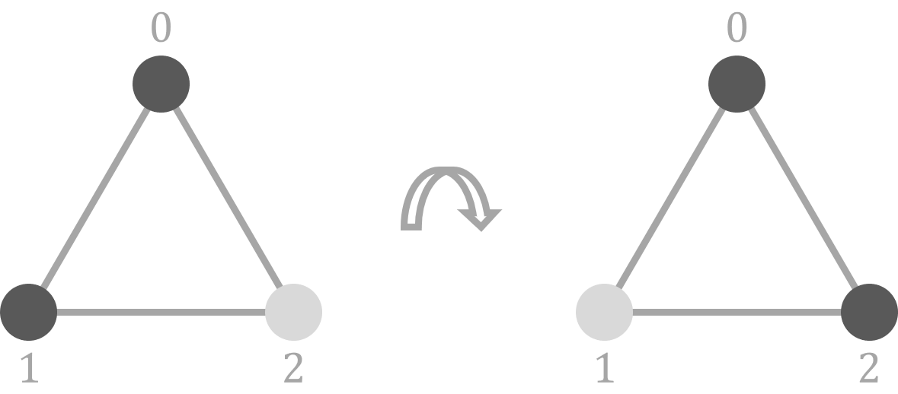
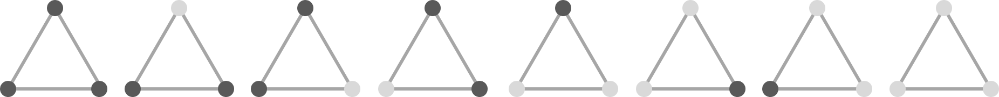
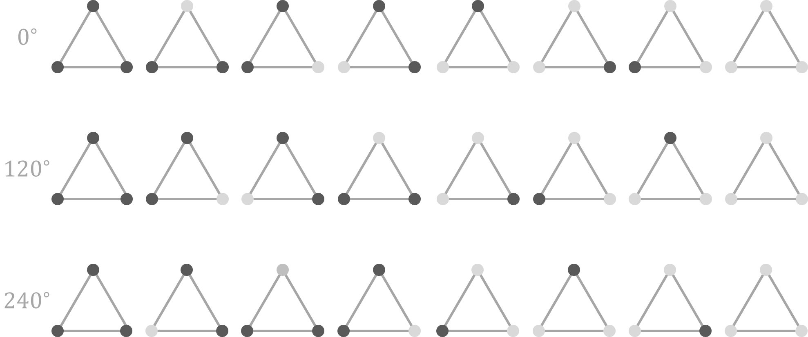
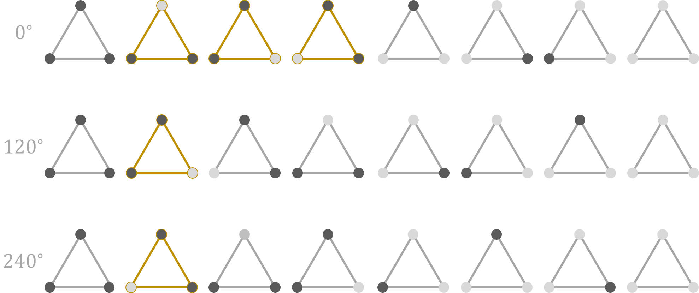
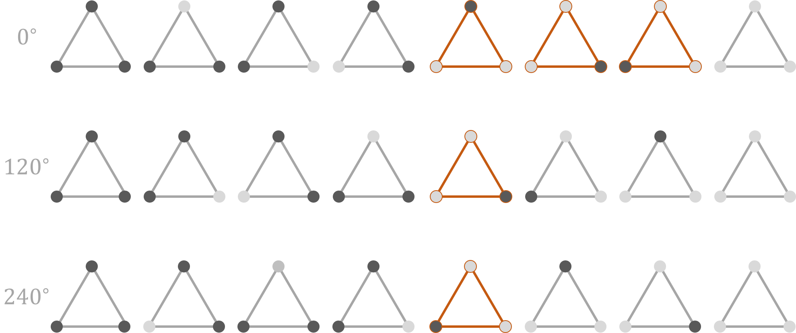
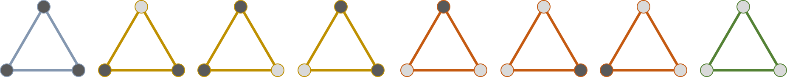

# 关系 { #relation }

- 集合的**笛卡尔积 (Cartesian product)**：
$$
A \times B = \left\{ (a, b) \mid a \in A, b \in B \right\}
$$
- 设 $A$ 是集合，集合 $A \times A$ 的每个子集 $R$ 叫做集合 $A$ 上的一个**关系 (relation)**。
- 若 $(a, b) \in R$，则称 $a$ 和 $b$ 有关系 $R$，记作 $aRb$。

## 等价关系 { #equivalence-relation }

若集合 $A$ 上的关系 $\sim$ 满足如下条件：

- **自反性**：$\forall a \in A$，$a \sim a$；
- **对称性**：$\forall a, b \in A$，若 $a \sim b$ 则 $b \sim a$；
- **传递性**：$\forall a, b \in A$，若 $a \sim b, \ b \sim c$，则 $a \sim c$；

则称 $\sim$ 是**等价关系 (equivalence relation)**

---

$$
a \sim b := a \equiv b \pmod 7
$$

- 自反性？对称性？传递性？
- 看起来可以把所有自然数分成 $7$ 类……

## 等价类 { #equivalence-class }

设 $\sim$ 是 $A$ 上的等价关系，$\forall a \in A$，$[a]$ 表示 $A$ 中与 $a$ 等价的全部元素构成的集合：

$$
[a] = \{ b \sim a \mid b \in A \}
$$

称 $[a]$ 为 $a$ 所在的**等价类 (equivalence class)**。

---

**若 $a, b \in A$ 且 $[a] \cap [b] \neq \emptyset$，则 $[a] = [b]$。**

::: { .fragment .fade-in-then-out style="height:0" }

- 假设 $k_1 \in [a]$ 且 $k_1 \notin [b]$，$k_2 \in [a] \cap [b]$；
- 则有 $k_1 \sim a, \ k_2 \sim a, \ k_2 \sim b$；
- 由传递性得 $k_1 \sim b$，与假设不符。

::: 

::: { .fragment }

- 集合 $A$ 可看作一些两两不相交的等价类的并：
  $$
  A = \bigcup\limits_{a \in R} [a] \text{（两两不相交之并）}
  $$
- $A$ 上的每个等价关系给出集合 $A$ 的一个**划分 (partition)**。

:::

::: { .notes }

关于 $R$，事实上是完全代表系，由等价类 $[a_i]$ 中选出一个元素构成，使得 $A$ 中每个元素都与 $R$ 中的某个元素等价，同时 $R$ 中的元素彼此不等价。

对于划分的定义：若 $A$ 是它的某些子集 $\{ A_i | i \in I \}$ 之并，且 $A_i$ 两两不交，则称其为集合 $A$ 的一个划分（或分拆）。 

我们可以看到，引入等价类的意义就是为了对集合中的元素进行某种程度上的分类。后面要介绍的轨道、陪集等本质上都是基于等价关系的。

:::

# 群 $(G, \cdot)$ { #group }

$G$ 是非空集合，且二元运算满足：

- 结合律：$(a \cdot b) \cdot c = a \cdot (b \cdot c)$
- 单位元 $e$：$\forall a \in G, \ ea = ae = a$ 
- 逆元：$\forall a \in G, \ \exist b \in G \text{ \ s.t. \ } ab = ba = e$
  
::: { .fragment }

若满足交换律，则称为**交换群**

:::

::: { .notes }

需要注意的是，构成群不一定要满足交换律。接下来我们会说明为什么对于群左右逆元是相等的。

:::

---

- 左右逆元相等：
  - 设 $x$ 是 $a$ 的左逆元，$y$ 是 $a$ 的右逆元，有：
  
    $$
    x = xe = x(ay) = (xa)y = y
    $$

- 满足消去律：
  - $\forall a, b, c \in G, \ ab = ac \Leftrightarrow b = c$

::: { .notes }

只要逆元存在就满足消去律：两边都乘上 $a^{-1}$ 即可。

:::  

## 子群 { #subgroup }

设 $(G, \cdot)$ 为群，$H$ 是 $G$ 的子集，若 $(H, \cdot)$ 成群，则称 $H$ 为 $G$ 的**子群 (subgroup)**，记作 $H \le G$；

## 陪集 { #coset }

设 $H \leq G$，对于 $x \in G$：

- $H$ 的一个**左陪集 (left coset)** $xH$：
  $$
  xH = \{ x \cdot h \mid h \in H \}
  $$
- $H$ 的一个**右陪集 (right coset)** $Hx$：
  $$
  Hx = \{ h \cdot x \mid h \in H \}
  $$

::: { .notes }

由于左右陪集相关内容是相似的，所以接下来只会分析左陪集。

:::

---

$$
\begin{aligned}
xH & = \{ x \cdot h \mid h \in H \}
\end{aligned}
$$

::: { .fragment }

$$
x \sim y := x \in yH
$$

- **自反性**：$x \in xH$；
- **对称性**：若 $y \in xH$，则 $x \in yH$；
- **传递性**：若 $z \in yH, \ y \in xH$，则 $z \in xH$。

:::

::: { .notes }

$x \sim y := x \in yH$ 是一个等价关系，这意味着我们可以借助陪集对群 $G$ 进行划分。

注意陪集不一定是 $G$ 的一个子群。

💡 提示:

1. 既然 $H$ 还是群，那么肯定有单位元；
2. 既然 $H$ 中逆元存在，有 $y = x \cdot h$， 自然有 $x = y \cdot h^{-1}$ 且 $h^{-1} \in H$；
3. $z = y \cdot h_1, \ y = x \cdot h_2 \Rightarrow z = x \cdot h_2h_1$，又 $h_2h_1 \in H$，自然得证。

:::

---

- 若 $xH \cap yH \neq \emptyset$，则 $xH = yH$；
- 利用陪集可以对群 $G$ 进行划分（陪集分解）：
  
  $$
  G = \bigcup\limits_{g \in R} gH \text{（两两不相交之并）}
  $$

::: { .notes }

既然是等价关系，那么可以得到这里的推论。

这里展现了对于群 $G$ 的左陪集分解，类似地 $R$ 称作 $G$ 对 $H$ 左陪集的代表元系。$R$ 由 $G$ 中的元素构成，并且这些用元素生成的左陪集彼此互不相同，与此同时这些左陪集的并集恰好为 $G$。

:::

---

- 对于 $a, b \in H, g \in G$，由消去律 $a \neq b \Leftrightarrow ga \neq gb$；
- 因此，$\forall g \in R, \ |gH| = |H|$:
  $$
  |G| = \sum\limits_{g \in R} |gH| 
  = \sum\limits_{g \in R} |H| 
  = |R| \cdot |H|
  $$

::: { .notes }

利用群 $G$ 的一个子群 $H$，我们可以借助陪集对 $G$ 进行划分。换句话说，群 $G$ 一定可以表示成若干个 $H$ 的互不相交的左（右）陪集之并，同时这些陪集的大小都是相同的。

把 $|R|$ 记作群 $H$ 对群 $G$ 的指数 $[G : H]$，就可以得到拉格朗日定理……

:::

## 拉格朗日定理 { #lagrange-theorem }

设 $G$ 为有限群，$H \leq G$，则：

$$
|G| = [G : H] \cdot |H|
$$

其中 $[G : H]$ 称为群 $H$ 对于群 $G$ 的**指数 (index)**。

::: { .notes }

说明 $G$ 的子群 $H$ 的大小一定是 G 大小的因子。

:::

# 置换 { #permutation }

一个集合的**置换 (permutation)** 即从该集合映射至自身的双射。

$$
\sigma = 
\left(\begin{array}{c}
1 & 2 & \dots & n \\
\sigma(1) & \sigma(2) & \dots & \sigma(n)
\end{array}\right)
$$

复合运算: $(f \circ g)(x) = f(g(x))$

::: { .notes }

可以理解成对于 $1 \sim n$ 的重排列。

回忆：双射描述的是两个集合间的关系。当然在这里，可以把置换成一种特殊的函数，则双射描述的就是定义域与值域之间的关系。

- 单射：对于定义域里的每一个 $x$，值域里都存在一个 $y$ 使得 $\sigma(x) = y$；
- 满射：对于值域里的每一个 $y$，定义域里都存在一个 $x$ 使得 $y = \sigma(x)$；
- 双射：同时满足单射和满射，即定义域和值域间存在严格的一一对应关系。

:::

---

$$
\left(\begin{array}{c} 
1 & 2 & 3 & 4 & 5 & 6 \\ 
4 & 5 & 1 & 3 & 6 & 2 
\end{array}\right)
$$

::: { .fragment }

$$
\begin{aligned}
1 & \rightarrow 4 \rightarrow 3 \\
2 & \rightarrow 5 \rightarrow 6
\end{aligned}
$$

任一置换都能被划分成若干不交的映射链？

:::

::: { .notes }

如果可以的话，这就意味着我们发现了一种能够更简单表示置换的方式（也就是后面要介绍的轮换表示法）。

:::

## 轮换表示法 { #cycle-notation }

$$ 
\left(\begin{array}{c}
a_1 & a_2 & \dots & a_n \\
a_2 & a_3 & \dots & a_1
\end{array}\right) \xRightarrow{\text{记作}} (a_1 \enspace a_2 \enspace \dots \enspace a_n)
$$

---

$$
\left(\begin{array}{c} 
1 & 2 & 3 & 4 & 5 & 6 \\ 
4 & 5 & 1 & 3 & 6 & 2 
\end{array}\right)
= (1 \enspace 4 \enspace 3) \cdot (2 \enspace 5 \enspace 6)
$$

::: { .fragment }

**若不计轮换内外的次序，对于任意置换的不交轮换分解是唯一的吗？**

:::

::: { .notes }

显然不交的轮换在复合时是满足交换律的，但是如果两个轮换相交就不好说了，例如试试计算 (1 2 3) * (3 4) 是否等于 (3 4) * (1 2 3)。

:::

---

- 对于恒等置换，显然分解是唯一的；
- 对于非恒等置换，$\exist i \text{ \ s.t. \ } \sigma(i) \neq i$。
  - $i \rightarrow \sigma(i) \rightarrow \sigma^2(i) \rightarrow \dots$
  - 由抽屉原理，$\exist t_1 < t_2 \text{ \ s.t. \ } \sigma^{t_1}(i) = \sigma^{t_2}(i)$
  - 令 $t$ 为使得 $\sigma^t(i) = i$ 的最小正整数，则：
    $$
    (i \enspace \sigma(i) \enspace \dots \enspace \sigma^{t - 1}(i))
    $$
    是一个轮换。

--- 

- 对于每个这样的 $i$ 都如此操作即可构造出一个唯一的不相交轮换分解式：
  - 每个元素在分解式中恰好出现 $1$ 次；
  - 每个元素所属于的轮换是固定的。

## 轮换的幂运算 { #power-of-cycle }

::: { .fragment .current-visible style="height:0" }

$$
(1 \enspace 2 \enspace 3 \enspace 4 \enspace 5 \enspace 6)
$$

:::

::: { .notes }

既然任意置换都可以被分解成若干不交轮换之积，那么如果轮换的幂运算能够快速进行，我们就可以快速地对任意置换进行幂运算。

:::

::: { .fragment .fade-in-then-out style="height:0" }

$$
\begin{aligned}
& (1 \enspace 2 \enspace 3 \enspace 4 \enspace 5 \enspace 6)^2 \\
& = (1 \enspace 3 \enspace 5) \cdot (2 \enspace 4 \enspace 6)
\end{aligned}
$$

:::

::: { .fragment .fade-in-then-out style="height:0" }

$$
\begin{aligned}
& (1 \enspace 2 \enspace 3 \enspace 4 \enspace 5 \enspace 6)^3 \\
& =  (1 \enspace 4) \cdot (2 \enspace 5) \cdot (3 \enspace 6)
\end{aligned}
$$

:::

::: { .fragment .fade-in-then-out style="height:0" }

$$
\begin{aligned}
& (1 \enspace 2 \enspace 3 \enspace 4 \enspace 5 \enspace 6)^4 \\
& = (1 \enspace 5 \enspace 3) \cdot (2 \enspace 6 \enspace 4)
\end{aligned}
$$

:::

---

$$
\sigma = (a_0 \enspace a_1 \enspace \dots \enspace a_{n - 1})
$$

- $\sigma^t(a_i) = a_{[(i + t) \bmod n]}$
- 令 $k \in N^{*} \text{ \ s.t. \ } \sigma^{tk}(a_i) = a_i$：
  
::: { .fragment .current-visible style="height:0" }
$$
i + tk \equiv i \pmod n
$$
:::

::: { .fragment }
$$
tk \equiv 0 \pmod n
$$

最小正整数解：$k = \frac{n}{\gcd(n, t)}$
:::

---

$$
\sigma = (a_0 \enspace a_1 \enspace \dots \enspace a_{n - 1})
$$

- $\sigma^t$ 可表示为 $\gcd(n, t)$ 个长为 $\frac{n}{\gcd(n, t)}$ 的轮换；
- $a_i$ 所在轮换里第 $j$ 个元素为 $a_{(i + jt) \bmod n}$。

  ::: { .fragment }
  - $a_i$ 所在轮换内元素下标模 $\gcd(n, t)$ 均为 $i$；
  - $a_0, a_1, \dots a_{\gcd(n, t) - 1}$ 一定位于不同轮换。
  :::

::: { .notes }

两个推论的证明不难（用初等数论就可以解决），大家可以自行思考……

💡 提示：

1. $\because \gcd(n, t) \mid t, \ \therefore \ i + jt \equiv i \pmod {\gcd(n, t)}$ 
2. 可看作上一条的推论。

:::

## 置换群 { #permutation-group }

$n$ 个元的所有置换，在复合运算 $\circ$ 下成群，称作 $n$ 元**对称群 (symmetric group)**，记作 $S_n$

- **结合律**：$(\sigma \circ \tau) \circ \phi = \sigma \circ (\tau \circ \phi)$
- **单位元**：恒等置换 $\epsilon \circ x = x$；
- **逆元**：置换是双射，故必然存在逆置换。

::: { .notes }

对于结合律的进一步说明：等式两边都是 $\sigma(\tau(\phi(x)))$

:::

# 群在集合上的作用 { #group-action }

$$
\begin{aligned}
\phi: G \times M & \longrightarrow M \\
(\sigma, x) & \longmapsto \sigma \circ x
\end{aligned}
$$

- $\forall x \in M$ 满足：
  - **单位元**：$\exist \epsilon \in G \text{ \ s.t. \ }\epsilon \circ x = x$
  - **结合律**：$\tau \circ (\sigma \circ x) = (\tau \circ \sigma) \circ x$

::: { .notes }

$G$ 是一个群（这里我们就看成置换群），$M$ 是一个集合。如果存在这样的映射 $\phi$ 并且满足上述条件，那么我们称群 $G$ 在集合 $M$ 上有群作用。

根据 Cayley 定理，每个群均同构于某个置换群。有了这个前提可能会更好理解群在集合上的作用。但是今天碍于主题，我们主要探讨置换群对于集合的作用。

:::

---

用黑白两色对等边三角形顶点染色，若可通过旋转得到的方案算相同方案，求方案数？

::: { .fragment .fade-in-then-out style="height:0" }

{ .plain style="background:transparent" }

:::

::: { .fragment }

$$
\begin{aligned}
G& = \{ \text{顺时针旋转 } 0^\circ, 120^\circ, 240^\circ \} \\
M & = \{ \text{不考虑同构时的染色方案} \}
\end{aligned}
$$

::: 

::: { .fragment }

{ .plain style="background:transparent" }

:::

---

::: { .fragment .fade-out style="height:0" data-fragment-index="1" }

{ .plain style="background:transparent" }

:::

::: { .fragment .current-visible style="height:0" data-fragment-index="1" }

{ .plain style="background:transparent" }

:::

::: { .fragment .current-visible style="height:0" data-fragment-index="2" }

{ .plain style="background:transparent" }

:::

::: { .notes }

- 图1：
  - 可以看到 $G \times M$ 后并不会产生新的元素，也就是说 $G \times M$ 和 $M$ 是一样大的。
  - 存在单位置换（旋转 $0^\circ$）使得它与任何一个染色方案作用都不发生变化；多个旋转作用于染色方案也是满足结合律的。所以这里我们称 $G$ 对 $M$ 有群作用。
- 图2：
  - 比如所有置换作用于第二个染色方案，我们实际上得到的就是与第二个方案等价的染色方案，并且我们得到的这些染色方案都是存在于原始集合里面的。

:::

---

{ .plain style="background:transparent" }

- 一种等价关系？
- 借助该等价关系对集合进行划分？
- 有多少不同的等价类？

## 轨道 { #orbit }

群 $G$ 作用于集合 $M$ 上，$x \in M$，称 $M$ 的子集

$$
\text{orb}_G(x) = \{ \sigma \circ x \mid \sigma \in G \}
$$

为 $x$ 在 $G$ 作用下的**轨道 (orbit)**，简称过 $x$ 的轨道。

::: { .fragment }

- $G$ 中置换作用于元素 $x$ 所能得到的不同结果；
- $|\text{orb}_G(x)|$： 对于元素 $x$ 而言，$G$ 中本质不同置换的种数。

:::

::: { .notes }

就比如刚刚对三角形着色的例子里，对于第二个染色方案分别用 $0^\circ, 120^\circ, 240^\circ$ 的旋转作用于它，便可以得到过它的轨道。

其实本质上就是等价类…… 部分地方记作 $\mathcal{O}_G(x)$，也有的地方直接用等价类的符号 $[x]$。

:::

---

$$
\text{orb}_G(x) = \{ \sigma \circ x \mid \sigma \in G \}
$$

$$
x \sim y := x \in \text{orb}_G(y)
$$

- **自反性**：$x \in \text{orb}_G(x)$；
- **对称性**：若 $y \in \text{orb}_G(x)$，则 $x \in \text{orb}_G(y)$；
- **传递性**：若 $z \in \text{orb}_G(y), y \in \text{orb}_G(x)$，则 $z \in \text{orb}_G(x)$。

::: { .notes }

定义关系 $x \sim y := x \in \text{orb}_G(y)$，那么这是一个等价关系~

💡 提示:

1. 既然是置换群，必然有恒等置换；
2. 既然置换群中逆元存在，有能把 x 变成 y 的置换则一定也有能把 y 变成 x 的置换；
3. 既然置换群中的运算封闭，若有置换能使 x -> y，另一置换能使 y -> z，则一定有一个置换能使 x -> z。

:::

---

- 若 $\text{orb}_G(x) \cap \text{orb}_G(y) \neq \emptyset$，则 $\text{orb}_G(x) = \text{orb}_G(y)$；
- 在 $M$ 的每一条轨道上取一个元素组成 $M$ 的一个子集 $R$，称为 $M$ 的**轨道的代表元集**，则：

  $$
  M = \bigcup\limits_{x \in R} \text{orb}_G(x)
  $$

  并且此中各 $\text{orb}_G(x)$ 互不相交。

## 稳定子 { #stabilizer }

设群 $G$ 作用于集合 $M$，对 $x \in M$，称

$$
\text{stab}_G(x) = \{ \sigma \mid \sigma \in G, \sigma \circ x = x \}
$$

为群 $G$ 作用下 $x$ 的**稳定子 (stabilizer)**。

::: { .fragment }

- 所有作用于 $x$ 后结果仍然为 $x$ 的置换。

:::

::: { .notes }

稳定子里面的元素都是置换，集合 $M$ 里面某个元素的稳定子包含所有使它不发生变化的置换。

又称固定子群、稳定子群、稳定化子…… 有的地方也写成 $G_m$ 或 $G^m$。

:::

---

{ .plain style="background:transparent" }

::: { .notes }

对于第一种和最后一种染色方案而言，其稳定子里面的元素就是三个置换，而对于其他染色方案稳定子都只有一个，就是旋转 $0^\circ$ 的置换。

:::

---

$$
\text{stab}_G(x) = \{ \sigma \circ x = x \mid \sigma \in G \} \le G
$$

::: { .fragment }

- **封闭性**：$\forall \sigma, \tau \in \text{stab}_G(x)$，$\sigma \circ \tau \circ x = \sigma \circ x = x$，故 $(\sigma \circ \tau) \in \text{stab}_G(x)$；
- **结合律**：显然置换的复合满足结合律；
- **单位元**：恒等置换 $\epsilon \circ x = x$；
- **逆元**：$\forall \sigma \in \text{stab}_G(x)$，$\sigma^{-1} \circ x = \sigma^{-1} \circ (\sigma \circ x) = \epsilon(x) = x$。

:::

---

$$
\text{stab}_G(x) = \{ \sigma \circ x = x \mid \sigma \in G \} \le G
$$

::: { .fragment .current-visible style="height:0" data-fragment-index="1"  }

- 既然是子群，那可以用来对 $G$ 进行左陪集划分；

:::

::: { .fragment data-fragment-index="2" }

- $\beta \text{stab}_G(x)$ 里的元素相当于作用于 $x$ 时 $G$ 中所有与 $\beta$ 等价的置换：

:::

::: { .fragment .current-visible style="height:0" data-fragment-index="2" }

$$
\beta \text{stab}_G(x) = \{ (\beta \circ \sigma) \circ x = \beta \circ x \mid \sigma \in G \}
$$

:::

::: { .fragment data-fragment-index="3" }

$$
\beta \text{stab}_G(x) = \{ \tau \circ x = \beta \circ x \mid \tau \in G \}
$$

:::

::: { .fragment data-fragment-index="4" }

$$
|G| = |\text{stab}_G(x)| \cdot [G:\text{stab}_G(x)]
$$

- $|\text{orb}_G(x)|$：对 $x$ 而言，$G$ 中所有本质不同置换种数。
  - 也就是不同的上述陪集的种数！

:::

## 轨道-稳定子定理 { #orbit-stabilizer-theorem }

设有限群 $G$ 作用于集合 $M$ ，$x \in M$，则：

$$
|G| = \mid \text{stab}_G(x) \mid \cdot \mid \text{orb}_G(x) \mid
$$

# Burnside 引理 { #burnside-lemma }

设有限群 $G$ 作用于有限集 $M$ 上，则轨道数：

$$
| M/G | = \frac{1}{|G|} \sum\limits_{\sigma \in G} |\text{fix}(\sigma)|
$$

其中 $\text{fix}(\sigma)$ 代表 $\sigma$ 的不动元构成的集合：

$$
\text{fix}(\sigma) = \{ x \mid x \in M, \sigma \circ x = x \}
$$

## 证明 { #proof-of-burnside-lemma }

$$
\begin{aligned}
\text{stab}_G(x) & = \{ \sigma \mid \sigma \in G, \sigma \circ x = x \} \\
\text{fix}(\sigma) & = \{ x \mid x \in M, \sigma \circ x = x \}
\end{aligned}
$$

$$
\sum\limits_{x \in M} \mid \text{stab}_G(x) \mid = \sum\limits_{\sigma \in G} \mid \text{fix}(\sigma) \mid
$$

::: { .notes }

稳定子是固定 $x$ 找 $\sigma$，而不动元是固定 $\sigma$ 找 $m$，故对于下面的等式两边本质上只是换了一下遍历的顺序。

:::

---

- 每个轨道对轨道数贡献为 $1$，故 $x \in M$ 对答案的贡献为 $\frac{1}{\mid \text{orb}_G(x) \mid}$：

$$
  \begin{aligned}
  | M/G | 
  & = \sum\limits_{x \in M} \frac{1}{ \mid \text{orb}_G(x) \mid } \\
  & = \sum\limits_{x \in M}\frac{ \mid \text{stab}_G(x) \mid }{ |G| } \text{（轨道-稳定子定理）} \\
  & = \frac{1}{|G|}\sum\limits_{\sigma \in G} \mid \text{fix}(\sigma) \mid
  \end{aligned}
$$

---

对正六边形的 $6$ 个顶点，一半涂黑一半涂白。若经旋转可得到的方案算相同方案，求方案数？

::: { .fragment }

$$
M = \{ \text{不计同构的涂色方案} \} \enspace |M| = \binom{6}{3} = 20
$$

$$
G = \{ \text{顺时针旋转} 0^\circ, 60^\circ, 120^\circ, 180^\circ, 240^\circ, 300^\circ \} \\
$$

记 $6$ 个顶点分别为 $A_1, A_2, \dots, A_6$

:::

---

### 旋转 $0^\circ$

$$
\left(\begin{array}{c} 
A_1 & A_2 & A_3 & A_4 & A_5 & A_6 \\ 
A_1 & A_2 & A_3 & A_4 & A_5 & A_6 
\end{array}\right)
$$

将这一置换作用于 $M$ 中的任意元素都不会使该元素发生变化，故不动元有 $20$ 个。

---

### 旋转 $60^\circ$

$$
\left(\begin{array}{c} 
A_1 & A_2 & A_3 & A_4 & A_5 & A_6 \\ 
A_6 & A_1 & A_2 & A_3 & A_4 & A_5 
\end{array}\right)
$$

若要成为不动元，则应当满足：

$$
A_1 = A_2 = \dots = A_6
$$

故没有不动元

---

### 旋转 $120^\circ$

$$
\left(\begin{array}{c} 
A_1 & A_2 & A_3 & A_4 & A_5 & A_6 \\ 
A_5 & A_6 & A_1 & A_2 & A_3 & A_4 
\end{array}\right)
$$

若要成为不动元，则应当满足：

$$
A_1 = A_3 = A_5, \ A_2 = A_4 = A_6
$$

故不动元数量为 $2$

---

### 旋转 $180^\circ$

$$
\left(\begin{array}{c} 
A_1 & A_2 & A_3 & A_4 & A_5 & A_6 \\ 
A_4 & A_5 & A_6 & A_1 & A_2 & A_3 
\end{array}\right)
$$

若要成为不动元，则应当满足：

$$
A_1 = A_4, \ A_2 = A_5, \ A_3 = A_6
$$

故没有不动元

---

- 旋转 $60^\circ$ 与 旋转 $300^\circ$ 情形相似；
- 旋转 $120^\circ$ 与 旋转 $240^\circ$ 情形相似。

轨道数：$\frac{1}{6}(20 + 2 + 2) = 4$

# Pólya 计数定理 { #polya-enumeration-theorem }

- 将置换表示为若干轮换乘积，若轮换内元素颜色均相同即为不动元（这样才能保证每一个点变成新点后的颜色与原先一致）；
- 记染色可选的颜色数为 $m$， $c(\sigma)$ 为置换 $\sigma$ 被分解为不交轮换乘积的个数，则：

  ::: { .fragment .current-visible style="height:0" }
  
  $$
  \text{fix}(\sigma) = m^{c(\sigma)}
  $$
  :::

  ::: { .fragment }

  $$
  | M/G | = \frac{1}{|G|} \sum\limits_{\sigma \in G} m^{c(\sigma)}
  $$

  :::

::: { .notes }

前面讲到了置换 $\sigma$ 可以被拆成若干个长度相等的映射链，也就是若干个大小相等的轮换。考虑在原始的（不考虑同构）的染色方案集合里，什么样的元素会成为置换 $\sigma$ 的下的不动元？

是不是只要每个轮换内的点我染的颜色都一样，那么是不是就成为不动元了…… 那么根据乘法原理就可以得到 Pólya 计数定理了。

:::

# 小结 { #a-breif-summary }

- [关系](#relation) | [等价关系](#equivalence-relation) | [等价类](#equivalence-class)
  - 对集合分类：等价类 $[a]$ 内的元素都与存在 $a$ 等价关系；
- [群](#group) | [子群](#subgroup) | [陪集](#coset)
  - 对群分类：陪集 $gH$ 里的所有元素都与 $g$ 存在等价关系；
- [群在集合上的作用](#group-action)
  - [轨道](#orbit)：$M$ 的子集，在 $G$ 作用下与 $x$ 等价的元素；
  - [稳定子](#stabilizer)：$G$ 的子群，对于 $x$ 而言 $G$ 中等价的置换；
  - [轨道-稳定子定理](#orbit-stabilizer-theorem) | [Burnside 引理](#burnside-lemma) | [Pólya 计数法](#polya-enumeration-theorem)

# 项链染色 { #coloring-necklace }

长为 $n$ 的环，$m$ 种颜色对环上元素染色，经旋转或翻转都算作相同方案

$n, m \le 10^9$

::: { .notes }

这里将之前对多边形顶点染色问题一般化。

:::

---

## 分析 { #cn-analysis }

$$
\begin{aligned}
G & = \{ \text{顺时针旋转} \frac{2\pi}{n}, \dots, (n - 1)\frac{2\pi}{n}, 2\pi, \\
& \text{过每一条对称轴的翻转 } \} \\
M & = \{ \text{不考虑同构的所有染色方案}  \}
\end{aligned}
$$

$G$ 作用于 $M$

::: { .fragment }

$G$ 中复合运算封闭吗？

:::

---

若将环上的元素按顺时针编号：$0, 1, \dots (n - 1)$

- 顺时针旋转 $k \frac{2\pi}{n}$：$\sigma_k(i) = (i + k) \bmod n$；
- 沿过点 $a$ 的对称轴翻转：
  $$
  \tau_a(i) =
  \begin{cases}
  i & i = a \text{ \ or \ } a \text{ 对面的点 } \\
  (2a - i) \bmod n & \text{ otherwise } 
  \end{cases}
  $$

::: { .fragment .current-visible style="height:0" }

- 注：若 $n$ 为偶数，则翻转对称轴可能同时过两条边的中点。这等同于共有 $2n$ 个点且不考虑此类对称轴的情况，故下面暂不考虑这种对称轴。

:::

::: { .fragment .current-visible style="height:0" }

- 考虑 $i \neq a$ 的情况（$i = a$ 显然封闭），若 $2 \mid k$：
$$
\sigma_k \circ \tau_a \circ i = (2a - i + k) \bmod n = \tau_{(a + \frac{k}{2}) \bmod n}
$$

:::

::: { .fragment }

- 考虑 $i \neq a$ 的情况（$i = a$ 显然封闭），若 $2 \nmid k$：
$$
\sigma_k \circ \tau_a \circ i = (2a - i + k) \bmod n = \tau_{(a + \frac{n + k}{2}) \bmod n}
$$

:::

::: { .notes }

$n$ 为偶数时，对称轴过两个点；而 $n$ 为奇数时，对称轴过一个点和一条边。

另外 对于 $n$ 为偶数时，由于对称轴可以同时过两条边，因此考虑的时候不妨在每条边中间再加一个点，即考虑 $2n$ 个点围成的环只过点的对称轴…… （因为上面只说明了过点的对称轴，所以不妨这么理解qwq）。

可能有点不严密，大家自己推一推应该也能发现是正确的（逃

:::

---

## 旋转 { #cn-rotation }

- 旋转置换一共 $n$ 种；
- 旋转 $\frac{2\pi}{n}$ 时只能分解成一个不交轮换；
- 旋转 $i \frac{2\pi}{n}$ 可看作前者的 $i$ 次幂，故可拆成 $\gcd(n, i)$ 个轮换：

$$
\sum\limits_{\sigma} \mid \text{fix}(\sigma) \mid = \sum\limits_{i = 1}^{n} m^{\gcd(n, i)}
$$

::: { .notes }

旋转 $\frac{2\pi}{n}$ 时显然只能拆成一个轮换。回忆前面关于快速求轮换幂的相关内容。

然而现在复杂度是 $\mathcal{O}(N)$ 的，需要借助数论知识进一步优化……

:::

---

$$
\begin{aligned}
\sum\limits_{g \in G} \mid \text{fix}(\sigma) \mid 
& = \sum\limits_{i = 1}^{n} m^{\gcd(n, i)} \\
& = \sum\limits_{d \mid n} m^d \sum\limits_{i = 1}^{n} [ \gcd(n, i) = d ] \\
& =\sum\limits_{d \mid n} m^d \sum\limits_{i = 1}^{\frac{n}{d}} [ \gcd(\frac{n}{d}, i) = 1 ] \\
& = \sum\limits_{d \mid n} m^d \cdot \varphi(\frac{n}{d})
\end{aligned}
$$

---

## 翻转 { #cn-flipping }

- 翻转置换一共 $n$ 种。
- $n$ 为偶数：
  - $\frac{n}{2}$ 条过点的对称轴：$c(\tau) = \frac{n}{2} + 1$
  - $\frac{n}{2}$ 条过边的对称轴：$c(\tau) = \frac{n}{2}$
$$
\sum\limits_{\tau} \mid \text{fix}(\tau) \mid 
= \frac{n}{2} \cdot m^{\frac{n}{2} + 1} + \frac{n}{2} \cdot m^{\frac{n}{2}} 
$$

---

- $n$ 为奇数：
  - $n$ 条 既过点又过边的对称轴：$c(\tau) = \frac{n + 1}{2}$

  $$
  \sum\limits_{\tau} \mid \text{fix}(\tau) \mid 
= n \cdot m^{\frac{n + 1}{2}}
  $$

## 结论 { #cn-finale }

$$
\begin{aligned}
| M/G | & = \frac{\sum\limits_{\sigma} \mid \text{fix}(\sigma) \mid + \sum\limits_{\tau} \mid \text{fix}(\tau) \mid}{2n} \\
& = \frac{1}{2n}\sum\limits_{d \mid n} m^d \cdot \varphi(\frac{n}{d}) \\
& + \frac{1}{2n} \begin{cases}
\frac{n}{2} \cdot m^{\frac{n}{2} + 1} + \frac{n}{2} \cdot m^{\frac{n}{2}} & 2 \mid n \\
n \cdot m^{\frac{n + 1}{2}} & 2 \nmid n
\end{cases}
\end{aligned}
$$

复杂度：$\mathcal{O}(d(n) \cdot \sqrt{n})$，$d(n)$ 代表 $n$ 的约数个数。

# 南昌 J. Summon { #icpc-2019-nanchang-j }

现要从 $4$ 种不同的水晶中取 $n$ 个围成一个圈，但有 $m$ 个限制条件：每条限制条件要求某四种水晶不能在围成的圈中连续出现。通过旋转可互相得到的方案算作一种方案，问有多少种本质不同的方案？（结果模 $998244353$）

$n \le 10^5, m \le 256$

::: { .notes }

这其实是去年老刘专题里面一道题的稍微加强版…… 原题是要求某两种不能连续，这里改成了某四种……（POJ 2888）

:::

## 分析 { #ncj-analysis }

$$
\begin{aligned}
G & = \{ \text{顺时针旋转} \frac{2\pi}{n}, \dots, (n - 1)\frac{2\pi}{n}, 2\pi \} \\
M & = \{ \text{满足限制且不计同构的染色方案} \}
\end{aligned}
$$

::: { .fragment }

- 单单把每一个轮换内的所有元素染成相同颜色可能破坏限制条件；
- 无法直接应用 Pólya 计数定理。

:::

::: { .notes }

之前说 Pólya 计数定理的时候，我们是基于同一个轮换内的所有元素都染色成同一个颜色得出的。在这道题目里，不动元不仅要满足轮换内元素颜色相等，同时在这一前提下还要满足限制条件。我们虽然没有办法直接套用 Pólya，但是只要能够求出不动点借助 Burnside 引理还是能够解决问题的……

:::

---

- 旋转 $\frac{2\pi}{n}$ 只能分解成一个不交轮换；
- 旋转 $i \frac{2\pi}{n}$ 可看作前者的 $i$ 次幂，因此：
  - 可表示为 $\gcd(n, i)$ 个不交轮换之积；
  - 标号模 $\gcd(n, i)$ 结果相同的点在同一轮换内。

::: { .fragment }

**对于旋转 $i \frac{2\pi}{n}$ 这一置换，只需确定前 $\gcd(n, i)$ 个元素的颜色即可知道该置换下不动元数量！**

:::

::: { .notes }

换句话说，前 $\gcd(n, i)$ 个元素一定是位于不同轮换内的。对于不动点而言，既然同一轮换内染色方案一致，那么整个染色方案完全就是由前 $\gcd(n, i)$ 个元素一直往后复制这样生成的（逃

可以考虑 DP。

:::

## DP 求不动元数量 { #ncj-dp }

- 记 $\text{v} \langle a, b, c, d \rangle$ 代表是否允许 $a, b, c, d$ 四种颜色相邻；

$$
\text{v} \langle a, b, c, d \rangle =
\begin{cases}
0 & \text{不允许 } a, b, c, d \text{ 相邻} \\
1 & \text{允许 } a, b, c, d \text{ 相邻}
\end{cases}
$$

---

- 记 $\text{dp} \langle i, a, b, c \rangle$ 代表 $i$ 个元素排成一排，最后 $3$ 个元素的颜色分别为 $a, b, c$ 的方案数：
  $$
  \text{dp} \langle i, a, b, c \rangle = \sum\limits_{k} \text{v} \langle k, a, b, c \rangle \cdot \text{dp} \langle i - 1, k, a, b \rangle
  $$

::: { .fragment }

- 枚举前 $3$ 个元素的颜色 $\langle a, b, c \rangle$：
  - 只初始化 $\text{dp} \langle 3, a, b, c \rangle = 1$；
  - $\text{dp} \langle m + 3, a, b, c \rangle$ 即为 $m$ 个元素围成环时不动元方案数。

:::

::: { .notes }

对于环上的问题不方便考虑的话不妨先拆成链上的问题考虑（就不用考虑首尾是否满足条件）…… 

最后要考虑首尾的情况的时候，不妨在尾多 DP 三个元素，然后只取首三个元素与末三个元素相同的方案。

这样做一次 DP 复杂度是 $\mathcal{O}(64^3 N)$ 的…… 而且对于每一种置换都要做一次…… 显然复杂度不可以接受。

看看能不能用矩阵快速幂优化。

:::

## 矩阵快速幂优化 DP { #ncj-matrix-fastpow }

$$
  \text{dp} \langle i, a, b, c \rangle = \sum\limits_{k} \text{v} \langle k, a, b, c \rangle \cdot \text{dp} \langle i - 1, k, a, b \rangle
$$

$$
\begin{aligned}
  \begin{bmatrix}
    \text{dp} \langle i, 1, 1, 1 \rangle \\
    \text{dp} \langle i, 1, 1, 2 \rangle \\
    \vdots \\
    \text{dp} \langle i, 4, 4, 4 \rangle
  \end{bmatrix}
\end{aligned}
= T \cdot
\begin{aligned}
  \begin{bmatrix}
    \text{dp} \langle i - 1, 1, 1, 1 \rangle \\
    \text{dp} \langle i - 1, 1, 1, 2 \rangle \\
    \vdots \\
    \text{dp} \langle i - 1, 4, 4, 4 \rangle
  \end{bmatrix}
\end{aligned}
$$

::: { .fragment .current-visible style="height:0" }

$$
\text{dp} \langle i, a, b, c \rangle = \sum\limits_{\langle j, k, l \rangle} T[a, b, c][j, k, l] \cdot \text{dp} \langle i - 1, j, k, l \rangle
$$

:::

::: { .fragment }

$$
T[ a, b, c ][ k, a, b ] = \text{v} \langle k, a, b, c \rangle
$$

:::

::: { .notes }

可以把后三个连续颜色 $<a, b, c>$ 看出一个可以用 $0 \sim 63$ 表示的一个状态，就更好理解了……

$T$ 中其余元素都是 $0$。

:::

---

- 枚举前三 $3$ 个元素的颜色 $\langle a, b, c \rangle$ 时，初始化：
$$
\begin{aligned}
  \begin{bmatrix}
    1 \\
    0 \\
    \vdots \\
    0
  \end{bmatrix}
\end{aligned},
\begin{aligned}
  \begin{bmatrix}
    0 \\
    1 \\
    \vdots \\
    0
  \end{bmatrix}
\end{aligned},
\dots, 
\begin{aligned}
  \begin{bmatrix}
    0 \\
    0 \\
    \vdots \\
    1
  \end{bmatrix}
\end{aligned}
$$
- 等价于 $T^{n}$ 直接乘上单位矩阵；
- $T^{n}$ 主对角线元素之和即为所有不动元数量。

::: { .notes }

置换 $\sigma$ 下不动元的个数只跟其能被分解成不交轮换乘积的轮换个数有关。

:::

## 结论 { #ncj-finale }

::: { .fragment .fade-out data-fragment-index="1" style="height:0" }

- 记 $T^i$ 对角线元素之和为 $f(i)$
- 旋转 $i \frac{2\pi}{n}$ 下不动元个数为 $f(\gcd(n, i))$

:::

::: { .fragment data-fragment-index="1" }

$$
\begin{aligned}
\sum\limits_{\sigma \in G} \mid \text{fix}(\sigma) \mid 
& = \sum\limits_{i = 1}^{n} f(\gcd(n, i)) \\
& = \sum\limits_{d \mid n} f(d) \cdot \sum\limits_{i = 1}^{n} [\gcd(n, i) = d] \\
& = \sum\limits_{d \mid n} f(d) \cdot \varphi(\frac{n}{d})
\end{aligned}
$$

- 复杂度： $\mathcal{O}(d(n) \cdot 64^3\log{n})$，其中 $d(n)$ 代表 $n$ 的约数个数。

:::

# 无向图同构计数 { #coloring-undirected-graph }

$n$ 个点无向完全图，$m$ 种颜色给边染色，求本质不同的染色方案数。

$n \le 60, \ m \le 10^3$

::: { .fragment }

- 两张图若**对点重标号**后可以重合即为同构；
- 把边的不存在当作一种颜色可将其推广至一般无向图同构。
  
:::

## 分析 { #cug-analysis }

$$
\begin{aligned}
G & = S_n \enspace (n \text{阶对称群}), \ \mid S_n \mid = n! \\
M & = \{ \text{不计同构的无向图染色方案} \}
\end{aligned}
$$

- 置换是对点的置换，而染色是对边染色；
- 两点确定一条边，分析边两端点的情况。

::: { .notes }

根据无向图同构的定义发现对于边的置换非常难找…… 要想办法把对点的置换与边的置换联系起来…… 既然两点可以确定一条边，那不妨分析边两边的情况。

后面会用类似 “点置换”、“点轮换” 和 “边置换”、“边轮换” 等用词对两者进行区分。

:::

## 两端在同一轮换内的边 { #cug-edge-case-1}

$$
\sigma = (1 \enspace 3 \enspace 5 \enspace 6) \cdot (2 \enspace 4)
$$

::: { .fragment .current-visible style="height:0" }

- 对于两端点位于同一点轮换内的边：
  - $\langle 1, 3 \rangle \rightarrow \langle 3 ,5 \rangle \rightarrow \langle 5, 6 \rangle \rightarrow \langle 6, 1 \rangle$
  - $\langle 1, 5 \rangle \rightarrow \langle 3, 6 \rangle$
  - $\langle 2, 4 \rangle$

:::

---

$$
(a_0 \enspace a_1 \enspace \dots \enspace a_{l - 1})
$$

$$
\langle a_i, a_j \rangle \rightarrow \langle a_{(i + 1) \bmod l}, a_{(j + 1) \bmod l} \rangle \rightarrow \dots
$$

::: { .fragment .current-visible style="height:0" }

$$
\begin{cases}
i + t \equiv i \pmod l \\
j + t \equiv j \pmod l
\end{cases}
$$

:::

::: { .fragment }

$$
t \equiv 0 \pmod l
$$

最小正整数解 $t = l$，则边轮换长度至多为 $l$。

:::

---

$$
(a_0 \enspace a_1 \enspace \dots \enspace a_{l  - 1})
$$

$$
\langle a_i, a_j \rangle \rightarrow \langle a_{(i + 1) \bmod l}, a_{(j + 1) \bmod l} \rangle \rightarrow \dots
$$

::: { .fragment .current-visible style="height:0" }

$$
\begin{cases}
i + t \equiv j \pmod l \\
j + t \equiv i \pmod l
\end{cases}
$$

:::

::: { .fragment }

$$
2i \equiv 2j \pmod l
$$

- 若 $2 \nmid l$，则 $i \equiv j \pmod l$，无法构成边；
- 若 $2 \mid l$，则 $i \equiv j \pmod {\frac{l}{2}}$，最小非负 $t = \frac{l}{2}$。

:::

::: { .notes }

下标间距相同的边必然在同一边轮换内。

:::

---

$$
(a_0 \enspace a_1 \enspace \dots \enspace a_{l - 1})
$$

- 对于边 $\langle a_i, a_j \rangle$ 所在的边轮换：
  - 若 $2 \mid l$ 且 $\mid j - i \mid = \frac{l}{2}$，则其大小为 $\frac{l}{2}$；
  - 否则其大小为 $l$；
- $\mid j - i \mid \bmod l$ 相同的边在同一边轮换内，故边轮换个数为 $\lfloor \frac{l}{2} \rfloor$。

::: { .notes }

换句话说：

- 两点在相同且大小为 $l$ 的点轮换里的边共可构成 $\lfloor \frac{l}{2} \rfloor$ 个边轮换，其中：
  - 若 $2 \nmid l$，则每个边轮换大小均为 $l$；
  - 若 $2 \mid l$，则一个边轮换大小为 $\frac{l}{2}$，其余边轮换大小为 $l$。

:::

## 两端在不同轮换内的边 { #cug-edge-case-2 }

$$
\sigma = (1 \enspace 3 \enspace 5 \enspace 6) \cdot (2 \enspace 4)
$$

- 两点在不同点轮换里的边：
  - $\langle 1, 2 \rangle \rightarrow \langle 3, 4 \rangle \rightarrow \langle 5, 2 \rangle \rightarrow \langle 6, 4 \rangle$
  - $\langle 1, 4 \rangle \rightarrow \langle 3, 2 \rangle \rightarrow \langle 5, 4 \rangle \rightarrow \langle 6, 2 \rangle$

---

$$
(a_0 \enspace a_1 \enspace \dots \enspace a_{l - 1}) \cdot (b_0 \enspace b_1 \enspace \dots \enspace b_{s - 1} )
$$

$$
\langle a_i, b_j \rangle \rightarrow \langle a_{(i + 1) \bmod l}, b_{(j + 1) \bmod s} \rangle \rightarrow \dots
$$

::: { .fragment }

$$
\begin{cases}
i + t \equiv i \pmod l \\
j + t \equiv j \pmod s
\end{cases}
$$

- 每个边轮换大小为 $\text{lcm}(l, s)$，共 $\frac{ls}{\text{lcm}(l, s)} = \gcd(l, s)$ 个。

:::

## 点轮换与边轮换的关系 { #cug-vertex-edge-relation }

$$
\sigma = \prod\limits_{i = 1}^{k} c_i \quad (\text{轮换 } c_i \text{ 长度为 } l_i)
$$

- 可表示成边轮换的个数：
  $$
  \sum\limits_{i = 1}^{k} \left\lfloor \frac{l_i}{2} \right\rfloor + \sum\limits_{i = 1}^{k}\sum\limits_{j = i + 1}^{k} \gcd(l_i, l_j)
  $$

::: { .fragment .current-visible style="height:0" }

- 不动元？每个边轮换内的边染色情况应当相同；
- $\mid S_n \mid = n!$，没办法枚举每一个置换……

:::

::: { .fragment }

- 边轮换的个数只跟每个点轮换的大小有关系；
- 枚举点轮换大小的情况（$n$ 的拆分方案）？

:::

::: { .notes }

想办法剪枝。我们并不关系每个边置换里面有哪些边或者有多少边…… 既然每个边轮换内的边颜色都要一样，我们只关心边轮换的个数就行了。

:::

## 剪枝 { #cug-pruning }

- 枚举 $n$ 的拆分方案：

  $$
  n = \sum\limits_{i = 1}^{k} l_i \ (l_1 \le l_2 \le \dots \le l_k)
  $$

- 每一种拆分方案对应多少点置换？

---

::: { .fragment .fade-out data-fragment-index="1" style="height:0" }

- $n$ 个点分配到轮换内（多重组合数）：
  $$
  \frac{n!}{\prod\limits_{i = 1}^{k} l_i!}
  $$

:::

::: { .fragment .current-visible data-fragment-index="1" style="height:0" }

- 再考虑轮换内的顺序（圆排列）：
  - 比如 $(1 \enspace 2 \enspace 3)$ 和 $(1 \enspace 3 \enspace 2)$ 算不同的置换
  $$
  \frac{n!}{\prod\limits_{i = 1}^{k} l_i!} \cdot \prod\limits_{i = 1}^{k} (l_i - 1)!
  $$

:::

::: { .fragment }

- 对于长度相等的轮换，其之间的顺序不计。
  - 记共有 $s$ 种不同长度的轮换，其中第 $i$ 种轮换的个数为 $q_i$，则： 
  $$
  \frac{n!}{\prod\limits_{i = 1}^{k} l_i} \cdot \prod\limits_{i = 1}^{s} \frac{1}{q_i!}
  $$

:::

## 结论 { #ucg-finale }

- 对 $n$ 的每一种拆分方案：$n = \sum\limits_{i = 1}^{k} l_i$
  - $l_1 \le l_2 \le \dots \le l_k$；
  - 记共有 $s$ 种不同长度的轮换，其中第 $i$ 种轮换的个数为 $q_i$；
  - 其对应的点轮换数量为：

$$
\frac{n!}{(\prod\limits_{i = 1}^{k} l_i) \cdot (\prod\limits_{i = 1}^{s} q_i!)}
$$

---

$$
\begin{aligned}
& \frac{1}{|G|} \sum\limits_{\sigma \in G} \mid \text{fix}(\sigma) \mid \\
& = \frac{1}{n!} \cdot \sum\frac{n!}{(\prod\limits_{i = 1}^{k} l_i) \cdot (\prod\limits_{i = 1}^{s} q_i!)} \cdot m^{\sum\limits_{i = 1}^{k} \left\lfloor \frac{l_i}{2} \right\rfloor + \sum\limits_{i = 1}^{k}\sum\limits_{j = i + 1}^{k} \gcd(l_i, l_j)}
\end{aligned}
$$

- 复杂度 $\mathcal{O} \left( \sum\limits_{p \in \text{Partition}(n)} \text{len}^2(p) \cdot \log{n} \right)$
- 其实题目数据范围内 $\text{Partition}(n)$ 大小不大…… 所以 $\mathcal{O}(\text{能过})$。

::: { .notes }

$\text{Partition}(n)$ 指 $n$ 的拆分方案数，而 $\text{len}(p)$ 指拆分方案 $p$ 的长度（即拆成了多少个点轮换） 

:::

---

### 思路回顾

- 置换是对点的置换，均可分解成点轮换之积；
- 染色对边染色，同一边轮换内边染色方案相同；
- 点轮换和边轮换之间的关系？
- 只关心边轮换个数，其只与点轮换的大小情况有关，枚举点轮换的大小情况……

  
# 谢谢大家 { #finale }

## 相关题目 #1 { #probset-1 }

- [HDU 1817: Necklace of Beads](http://acm.hdu.edu.cn/showproblem.php?pid=1817)
- [HDU 3547: DIY Cube](http://acm.hdu.edu.cn/showproblem.php?pid=3547)
- [HDU 3441: Rotation](http://acm.hdu.edu.cn/showproblem.php?pid=3441)
- [POJ 2888: Magic Bracelet](http://poj.org/problem?id=2888)
- [洛谷 P1446: Cards](https://www.luogu.com.cn/problem/P1446)

## 相关题目 #2 { #probset-2 }

- [洛谷 P4128: 有色图](https://www.luogu.com.cn/problem/P4128)
- [ICPC 2014 鞍山 K: Colorful Toy](http://acm.hdu.edu.cn/showproblem.php?pid=5080)
- [HDU 6360: Kaleidoscope](http://acm.hdu.edu.cn/showproblem.php?pid=6360)
- [ICPC 2019 南昌 J: Summon](https://nanti.jisuanke.com/t/42585)
- [ICPC 2019 银川 M: Crazy Cake](https://nanti.jisuanke.com/t/42393)

::: { .notes }

本次讲解只讲了一些比较初步的应用，而给的题目里面很多更加灵活，不保证仅靠幻灯片里的内容就能解出这些题（狗头保命）……

:::

## 参考资料 { #reference }

- 近世代数引论/冯克勤,李尚志,章璞编著.-3版.-合肥：中国科学技术大学出版社,2009.12
- 近世代数初步/石生明.-2版.-北京：高等教育出版社,2006.3
- Contemporary Abstract Algebra/Joseph A. Gallian.-8th Edition
- [群论初探 - nosta - 博客园](https://www.cnblogs.com/nosta/p/9444576.html)
